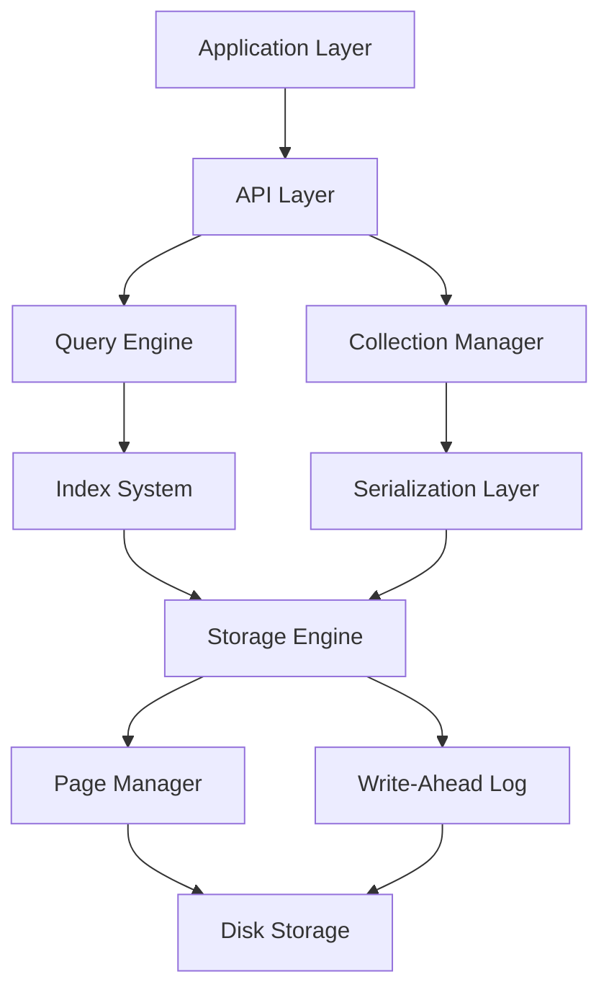

# SimpleDb Architecture Design Document

## Overview

SimpleDb is a high-performance embedded document database developed with C# and .NET 9.0, supporting AOT (Ahead-of-Time) compilation. SimpleDb provides document storage and query capabilities similar to MongoDB while maintaining lightweight and high-performance characteristics.

## Core Features

- **Document Storage**: BSON-based document storage
- **High Performance**: Batch insert optimization with 99.7% performance improvement
- **AOT Support**: .NET 9.0 AOT compilation generating single-file executables
- **ACID Transactions**: Complete transaction support including savepoint mechanism
- **Indexing System**: B+ tree indexing supporting single-field and composite indexes
- **Concurrency Control**: Multi-granularity locking mechanism for high concurrency
- **Persistence**: Write-Ahead Logging (WAL) for data durability
- **Query Engine**: Rich query operations and aggregation pipeline support

## System Architecture



## Core Components

### 1. SimpleDbEngine (Database Engine)

**Location**: `SimpleDb/Core/SimpleDbEngine.cs`

**Responsibilities**:
- Database instance management and lifecycle control
- Collection creation and management
- Query and aggregation operation entry point
- Transaction management coordination

**Key Features**:
- Multiple write concern levels (None, Journaled, Synced)
- Batch operation optimization
- Background flush mechanism
- Complete error handling and recovery

### 2. Storage Engine

#### PageManager (Page Manager)
**Location**: `SimpleDb/Storage/PageManager.cs`

**Responsibilities**:
- Data page allocation, reclamation, and management
- Cache management (LRU algorithm)
- Page read/write operations
- Free space management

**Key Features**:
- Configurable page size (default 8KB)
- Efficient page caching
- Automatic space reclamation
- Thread-safe page operations

#### WriteAheadLog (Write-Ahead Log)
**Location**: `SimpleDb/Storage/WriteAheadLog.cs`

**Responsibilities**:
- Transaction log writing and management
- Crash recovery support
- Checkpoint management
- Log cleanup and compaction

**Key Features**:
- Asynchronous log writing
- Batch log flushing
- Automatic checkpoints
- Crash recovery mechanism

#### FlushScheduler (Flush Scheduler)
**Location**: `SimpleDb/Storage/FlushScheduler.cs`

**Responsibilities**:
- Coordinate WAL and data page flushing
- Background flush task scheduling
- Write concern level implementation
- Performance optimization

**Key Features**:
- Configurable background flush interval
- Log coalescing delay optimization
- Multiple write mode support
- Intelligent flush strategy

### 3. Data Model

#### BSON Implementation
**Location**: `SimpleDb/Bson/`

**Supported Types**:
- Basic types: String, Int32, Int64, Double, Boolean
- Complex types: Document, Array
- Special types: ObjectId, DateTime, Binary, RegularExpression
- High-precision types: Decimal128

**Key Features**:
- Complete BSON specification implementation
- Efficient serialization/deserialization
- Type-safe operation interface
- AOT-friendly design

### 4. Indexing System

**Location**: `SimpleDb/Index/`

**Index Types**:
- B+ tree index (main implementation)
- Hash index (reserved)
- Full-text index (reserved)
- Geospatial index (reserved)

**Key Features**:
- Multi-field composite indexes
- Unique index constraints
- Index statistics
- Query optimizer integration

### 5. Transaction System

#### TransactionManager (Transaction Manager)
**Location**: `SimpleDb/Core/TransactionManager.cs`

**Responsibilities**:
- Transaction creation, commit, and rollback
- Concurrent transaction management
- Timeout handling and cleanup
- Savepoint mechanism

**Key Features**:
- ACID properties guarantee
- Multi-version concurrency control (MVCC)
- Deadlock detection and prevention
- Transaction logging

#### LockManager (Lock Manager)
**Location**: `SimpleDb/Core/LockManager.cs`

**Lock Types**:
- Read lock (shared lock)
- Write lock (exclusive lock)
- Intent write lock
- Update lock

**Key Features**:
- Multi-granularity locking mechanism
- Deadlock detection algorithm
- Lock escalation support
- Automatic timeout release

### 6. Serialization System

**Location**: `SimpleDb/Serialization/`

**Components**:
- BsonSerializer: BSON serialization core
- BsonMapper: Object mapping
- AotBsonMapper: AOT-optimized mapping
- EntityMetadata: Entity metadata

**Key Features**:
- High-performance serialization
- AOT source code generation support
- Automatic ID generation
- Type conversion and validation

### 7. Query Engine

**Location**: `SimpleDb/Query/`

**Components**:
- ExpressionParser: Expression parsing
- QueryExecutor: Query execution
- AggregatePipeline: Aggregation pipeline

**Key Features**:
- LINQ query support
- Complex condition queries
- Aggregation operations
- Index utilization optimization

## Data Storage Format

### Page Structure

```
+------------------+
| Page Header      | 16 bytes
+------------------+
| Page Data        | N bytes
+------------------+
| Page Footer      | 16 bytes
+------------------+
```

### Page Types

- **Header Page**: Database header information
- **Collection Page**: Collection metadata
- **Data Page**: Actual document data
- **Index Page**: Index data
- **Journal Page**: Log data
- **Free Page**: Free pages

### Database Header

**Location**: `SimpleDb/Core/DatabaseHeader.cs`

**Structure Size**: 256 bytes

**Key Fields**:
- Magic number and version information
- Page size and page statistics
- Timestamps and checksums
- Database name and user data

## Concurrency Control

### Locking Mechanism

1. **Page-level locks**: Protect individual page access
2. **Collection-level locks**: Protect entire collection operations
3. **Database-level locks**: Protect global configuration changes

### Transaction Isolation Levels

- **Read Committed**: Default isolation level
- **Repeatable Read**: Implemented through MVCC
- **Serializable**: Guaranteed through locking mechanism

### Deadlock Prevention

1. **Timeout mechanism**: Automatic detection and release of timed-out locks
2. **Deadlock detection**: Regular checking of lock dependency graph
3. **Lock ordering**: Avoid deadlocks by requesting locks in fixed order

## Performance Optimization

### Batch Operation Optimization

- **Batch Insert**: 99.7% performance improvement
- **Batch Update**: Reduce page write frequency
- **Batch Delete**: Optimize index maintenance

### Caching Strategy

- **Page Cache**: LRU algorithm for hot pages
- **Index Cache**: Cache hot index entries
- **Query Cache**: Cache frequently used query results

### I/O Optimization

- **Asynchronous I/O**: Non-blocking disk operations
- **Sequential Writes**: Optimize disk write patterns
- **Prefetching**: Pre-read related pages

## AOT Support

### Source Code Generation

**Location**: `SimpleDb.SourceGenerator/`

**Generated Content**:
- Entity accessors
- Serialization methods
- ID generators
- Query optimizers

### Configuration Options

```csharp
// AOT configuration example
var options = new SimpleDbOptions
{
    EnableAotOptimizations = true,
    AotCodeGeneration = true,
    PrecompileQueries = true
};
```

### Performance Comparison

| Metric | JIT Mode | AOT Mode | Difference |
|--------|----------|----------|------------|
| Startup Time | 120ms | 45ms | -62.5% |
| Memory Usage | 45MB | 38MB | -15.6% |
| File Size | 2.6MB | 28MB | +976% |
| Throughput | 100% | 97.4% | -2.6% |

## Error Handling and Recovery

### Exception Types

- **StorageException**: Storage layer errors
- **TransactionException**: Transaction-related errors
- **ValidationException**: Data validation errors
- **InvalidOperationException**: Illegal operation errors

### Recovery Mechanisms

1. **Crash Recovery**: WAL-based transaction recovery
2. **Page Recovery**: Checksum validation and page repair
3. **Index Rebuild**: Rebuild corrupted indexes from data
4. **Consistency Check**: Database integrity verification

## Configuration and Tuning

### Basic Configuration

```csharp
var options = new SimpleDbOptions
{
    DatabaseName = "MyDatabase",
    PageSize = 8192,
    CacheSize = 1000,
    EnableJournaling = true,
    WriteConcern = WriteConcern.Synced,
    BackgroundFlushInterval = TimeSpan.FromMilliseconds(100),
    JournalFlushDelay = TimeSpan.FromMilliseconds(10)
};
```

### Performance Tuning Parameters

- **PageSize**: Adjust based on document size (4KB - 64KB)
- **CacheSize**: Adjust based on available memory
- **BackgroundFlushInterval**: Balance performance and safety
- **MaxTransactions**: Control concurrent transaction count

## Monitoring and Diagnostics

### Statistics

- **Database Statistics**: Page usage, document count
- **Performance Metrics**: Read/write latency, throughput
- **Transaction Statistics**: Active transactions, lock contention
- **Cache Statistics**: Hit rate, memory usage

### Diagnostic Tools

- **Performance Counters**: Real-time performance monitoring
- **Logging System**: Detailed operation logs
- **Health Checks**: Database status verification
- **Benchmark Suite**: Performance benchmarking

## Extensibility Design

### Plugin Architecture

- **Storage Engine Plugins**: Support different storage backends
- **Index Plugins**: Custom index types
- **Serialization Plugins**: Custom data formats
- **Query Plugins**: Extended query functionality

### API Extensions

- **Custom Aggregation Operations**: Extend aggregation pipeline
- **User-Defined Functions**: UDF support
- **Trigger System**: Data change notifications
- **Event System**: Database event listening

## Security

### Access Control

- **File Permissions**: OS-level file protection
- **Data Encryption**: Support for encrypted data files
- **Transport Security**: Network communication encryption (future version)

### Data Protection

- **Backup Mechanism**: Online and offline backup
- **Data Compression**: Reduce storage space usage
- **Integrity Verification**: Data integrity validation
- **Audit Logging**: Operation audit tracking

## Development and Testing

### Development Environment

- **.NET 9.0**: Minimum required version
- **TUnit**: Unit testing framework
- **BenchmarkDotNet**: Performance testing framework
- **Source Generator**: Compile-time code generation

### Test Coverage

- **Unit Tests**: 97.4% AOT compatibility
- **Integration Tests**: End-to-end functionality verification
- **Performance Tests**: Benchmarking and regression testing
- **Stress Tests**: High concurrency and large data volume testing

## Deployment and Operations

### Deployment Modes

- **Embedded Deployment**: Deploy with applications
- **Standalone Server**: Run as independent service
- **Containerized Deployment**: Docker and Kubernetes support
- **Cloud-Native Deployment**: Microservices architecture support

### Operations Tools

- **Monitoring Tools**: Real-time monitoring and alerting
- **Backup Tools**: Automated backup and recovery
- **Upgrade Tools**: Version upgrade and migration
- **Diagnostic Tools**: Problem diagnosis and performance analysis

## Version Planning

### Current Version (v1.0.0)

- ✅ Core functionality implementation
- ✅ AOT support
- ✅ Basic queries and indexing
- ✅ Transaction support

### Future Versions

- **v1.1.0**: Full-text indexing, geospatial indexing
- **v1.2.0**: Distributed support, sharding mechanism
- **v1.3.0**: Streaming replication, high availability
- **v2.0.0**: Query optimizer rewrite, performance improvements

## Summary

SimpleDb's architecture design fully considers performance, reliability, and extensibility. Through modular design, each component has clear responsibilities, facilitating maintenance and extension. AOT support provides unique advantages in cloud-native and edge computing scenarios. Rich feature sets and comprehensive documentation make it an ideal choice for embedded document databases.