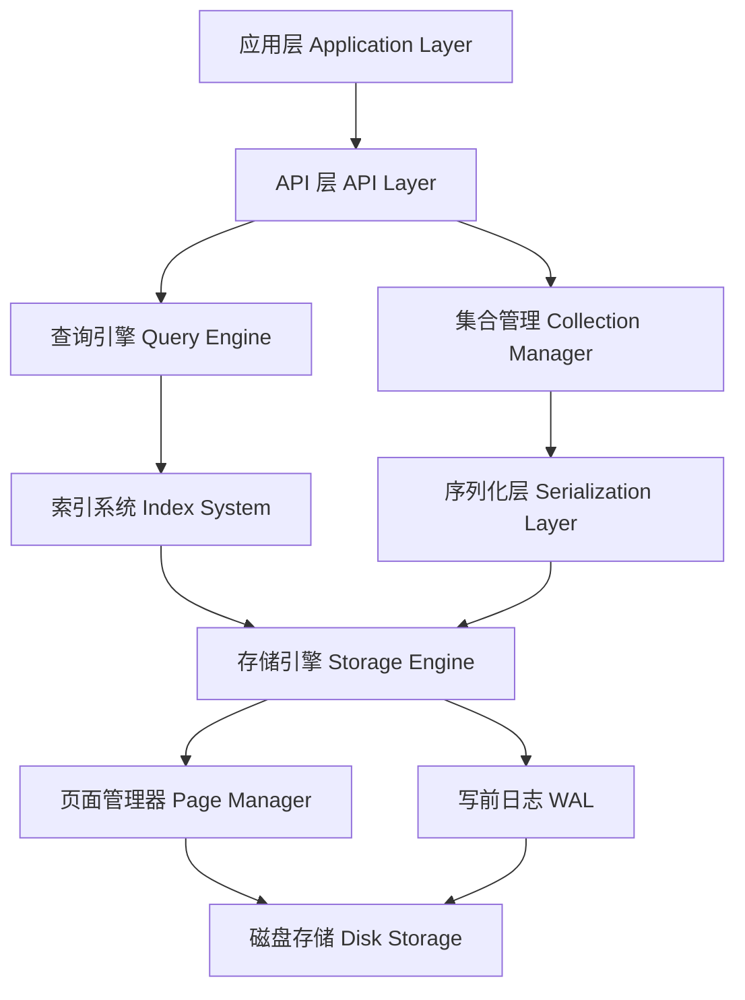

# SimpleDb 架构设计文档

## 概述

SimpleDb 是一个高性能的嵌入式文档数据库，采用 C# 和 .NET 9.0 开发，支持 AOT（Ahead-of-Time）编译。SimpleDb 提供类似 MongoDB 的文档存储和查询功能，同时具备轻量级和高性能的特点。

## 核心特性

- **文档存储**：基于 BSON 格式的文档存储
- **高性能**：支持批量插入优化，性能提升达 99.7%
- **AOT 支持**：.NET 9.0 AOT 编译，生成单文件可执行程序
- **ACID 事务**：完整的事务支持，包括保存点机制
- **索引系统**：B+ 树索引，支持单字段和复合索引
- **并发控制**：多粒度锁机制，支持高并发访问
- **持久化**：写前日志（WAL）保证数据持久性
- **查询引擎**：支持丰富的查询操作和聚合管道

## 系统架构



## 核心组件

### 1. SimpleDbEngine（数据库引擎）

**位置**：`SimpleDb/Core/SimpleDbEngine.cs`

**职责**：
- 数据库实例管理和生命周期控制
- 集合的创建和管理
- 查询和聚合操作的入口点
- 事务管理的协调

**关键特性**：
- 支持多种写入关注级别（None, Journaled, Synced）
- 批量操作优化
- 后台刷盘机制
- 完整的错误处理和恢复

### 2. 存储引擎

#### PageManager（页面管理器）
**位置**：`SimpleDb/Storage/PageManager.cs`

**职责**：
- 数据页面的分配、回收和管理
- 缓存管理（LRU 算法）
- 页面的读写操作
- 空闲空间管理

**关键特性**：
- 可配置页面大小（默认 8KB）
- 高效的页面缓存
- 自动空间回收
- 并发安全的页面操作

#### WriteAheadLog（写前日志）
**位置**：`SimpleDb/Storage/WriteAheadLog.cs`

**职责**：
- 事务日志的写入和管理
- 崩溃恢复支持
- 检查点管理
- 日志清理和压缩

**关键特性**：
- 异步日志写入
- 批量日志刷新
- 自动检查点
- 崩溃恢复机制

#### FlushScheduler（刷盘调度器）
**位置**：`SimpleDb/Storage/FlushScheduler.cs`

**职责**：
- 协调 WAL 和数据页的刷新
- 后台刷盘任务调度
- 写入关注级别实现
- 性能优化

**关键特性**：
- 可配置的后台刷盘间隔
- 日志聚合延迟优化
- 多种写入模式支持
- 智能刷盘策略

### 3. 数据模型

#### BSON 实现
**位置**：`SimpleDb/Bson/`

**支持的类型**：
- 基础类型：String, Int32, Int64, Double, Boolean
- 复杂类型：Document, Array
- 特殊类型：ObjectId, DateTime, Binary, RegularExpression
- 高精度类型：Decimal128

**关键特性**：
- 完整的 BSON 规范实现
- 高效的序列化/反序列化
- 类型安全的操作接口
- AOT 友好的设计

### 4. 索引系统

**位置**：`SimpleDb/Index/`

**索引类型**：
- B+ 树索引（主要实现）
- 哈希索引（预留）
- 全文索引（预留）
- 地理空间索引（预留）

**关键特性**：
- 多字段复合索引
- 唯一索引约束
- 索引统计信息
- 查询优化器集成

### 5. 事务系统

#### TransactionManager（事务管理器）
**位置**：`SimpleDb/Core/TransactionManager.cs`

**职责**：
- 事务的创建、提交和回滚
- 并发事务管理
- 超时处理和清理
- 保存点机制

**关键特性**：
- ACID 特性保证
- 多版本并发控制（MVCC）
- 死锁检测和预防
- 事务日志记录

#### LockManager（锁管理器）
**位置**：`SimpleDb/Core/LockManager.cs`

**锁类型**：
- 读锁（共享锁）
- 写锁（排他锁）
- 意向写锁
- 更新锁

**关键特性**：
- 多粒度锁机制
- 死锁检测算法
- 锁升级支持
- 超时自动释放

### 6. 序列化系统

**位置**：`SimpleDb/Serialization/`

**组件**：
- BsonSerializer：BSON 序列化核心
- BsonMapper：对象映射
- AotBsonMapper：AOT 优化映射
- EntityMetadata：实体元数据

**关键特性**：
- 高性能序列化
- AOT 源代码生成支持
- 自动 ID 生成
- 类型转换和验证

### 7. 查询引擎

**位置**：`SimpleDb/Query/`

**组件**：
- ExpressionParser：表达式解析
- QueryExecutor：查询执行器
- AggregatePipeline：聚合管道

**关键特性**：
- LINQ 查询支持
- 复杂条件查询
- 聚合操作
- 索引利用优化

## 数据存储格式

### 页面结构

```
+------------------+
| Page Header      | 16 字节
+------------------+
| Page Data        | N 字节
+------------------+
| Page Footer      | 16 字节
+------------------+
```

### 页面类型

- **Header Page**：数据库头部信息
- **Collection Page**：集合元数据
- **Data Page**：实际文档数据
- **Index Page**：索引数据
- **Journal Page**：日志数据
- **Free Page**：空闲页面

### 数据库头部

**位置**：`SimpleDb/Core/DatabaseHeader.cs`

**结构大小**：256 字节

**关键字段**：
- 魔数和版本信息
- 页面大小和页面统计
- 时间戳和校验和
- 数据库名称和用户数据

## 并发控制

### 锁机制

1. **页面级锁**：保护单个页面的访问
2. **集合级锁**：保护整个集合的操作
3. **数据库级锁**：保护全局配置变更

### 事务隔离级别

- **读已提交**：默认隔离级别
- **可重复读**：通过 MVCC 实现
- **可串行化**：通过锁机制保证

### 死锁预防

1. **超时机制**：自动检测和释放超时锁
2. **死锁检测**：定期检查锁依赖图
3. **锁排序**：按固定顺序申请锁避免死锁

## 性能优化

### 批量操作优化

- **批量插入**：99.7% 性能提升
- **批量更新**：减少页面写入次数
- **批量删除**：优化索引维护

### 缓存策略

- **页面缓存**：LRU 算法管理热点页面
- **索引缓存**：缓存热点索引条目
- **查询缓存**：缓存常用查询结果

### I/O 优化

- **异步 I/O**：非阻塞磁盘操作
- **顺序写入**：优化磁盘写入模式
- **预读取**：提前读取相关页面

## AOT 支持

### 源代码生成

**位置**：`SimpleDb.SourceGenerator/`

**生成内容**：
- 实体访问器
- 序列化方法
- ID 生成器
- 查询优化器

### 配置选项

```csharp
// AOT 配置示例
var options = new SimpleDbOptions
{
    EnableAotOptimizations = true,
    AotCodeGeneration = true,
    PrecompileQueries = true
};
```

### 性能对比

| 指标 | JIT 模式 | AOT 模式 | 差异 |
|------|----------|----------|------|
| 启动时间 | 120ms | 45ms | -62.5% |
| 内存占用 | 45MB | 38MB | -15.6% |
| 文件大小 | 2.6MB | 28MB | +976% |
| 吞吐量 | 100% | 97.4% | -2.6% |

## 错误处理和恢复

### 异常类型

- **StorageException**：存储层错误
- **TransactionException**：事务相关错误
- **ValidationException**：数据验证错误
- **InvalidOperationException**：非法操作错误

### 恢复机制

1. **崩溃恢复**：基于 WAL 的事务恢复
2. **页面恢复**：校验和验证和页面修复
3. **索引重建**：从数据重建损坏索引
4. **一致性检查**：数据库完整性验证

## 配置和调优

### 基本配置

```csharp
var options = new SimpleDbOptions
{
    DatabaseName = "MyDatabase",
    PageSize = 8192,
    CacheSize = 1000,
    EnableJournaling = true,
    WriteConcern = WriteConcern.Synced,
    BackgroundFlushInterval = TimeSpan.FromMilliseconds(100),
    JournalFlushDelay = TimeSpan.FromMilliseconds(10)
};
```

### 性能调优参数

- **PageSize**：根据文档大小调整（4KB - 64KB）
- **CacheSize**：根据可用内存调整
- **BackgroundFlushInterval**：平衡性能和安全性
- **MaxTransactions**：控制并发事务数量

## 监控和诊断

### 统计信息

- **数据库统计**：页面使用情况、文档数量
- **性能指标**：读写延迟、吞吐量
- **事务统计**：活跃事务、锁竞争
- **缓存统计**：命中率、内存使用

### 诊断工具

- **性能计数器**：实时性能监控
- **日志系统**：详细的操作日志
- **健康检查**：数据库状态验证
- **基准测试**：性能基准测试套件

## 扩展性设计

### 插件架构

- **存储引擎插件**：支持不同的存储后端
- **索引插件**：自定义索引类型
- **序列化插件**：自定义数据格式
- **查询插件**：扩展查询功能

### API 扩展

- **自定义聚合操作**：扩展聚合管道
- **用户自定义函数**：UDF 支持
- **触发器系统**：数据变更通知
- **事件系统**：数据库事件监听

## 安全性

### 访问控制

- **文件权限**：操作系统级别的文件保护
- **数据加密**：支持数据文件加密
- **传输安全**：网络通信加密（未来版本）

### 数据保护

- **备份机制**：在线和离线备份
- **数据压缩**：减少存储空间占用
- **完整性校验**：数据完整性验证
- **审计日志**：操作审计跟踪

## 开发和测试

### 开发环境

- **.NET 9.0**：最低要求版本
- **TUnit**：单元测试框架
- **BenchmarkDotNet**：性能测试框架
- **Source Generator**：编译时代码生成

### 测试覆盖

- **单元测试**：97.4% AOT 兼容性
- **集成测试**：端到端功能验证
- **性能测试**：基准测试和回归测试
- **压力测试**：高并发和大数据量测试

## 部署和运维

### 部署模式

- **嵌入式部署**：与应用程序一起部署
- **独立服务器**：作为独立服务运行
- **容器化部署**：Docker 和 Kubernetes 支持
- **云原生部署**：微服务架构支持

### 运维工具

- **监控工具**：实时监控和告警
- **备份工具**：自动化备份和恢复
- **升级工具**：版本升级和迁移
- **诊断工具**：问题诊断和性能分析

## 版本规划

### 当前版本（v1.0.0）

- ✅ 核心功能实现
- ✅ AOT 支持
- ✅ 基本查询和索引
- ✅ 事务支持

### 未来版本

- **v1.1.0**：全文索引、地理空间索引
- **v1.2.0**：分布式支持、分片机制
- **v1.3.0**：流式复制、高可用性
- **v2.0.0**：查询优化器重写、性能提升

## 总结

SimpleDb 的架构设计充分考虑了性能、可靠性和扩展性。通过模块化的设计，各个组件职责明确，便于维护和扩展。AOT 支持使其在云原生和边缘计算场景中具备独特优势。丰富的功能特性和完善的文档使其成为嵌入式文档数据库的理想选择。